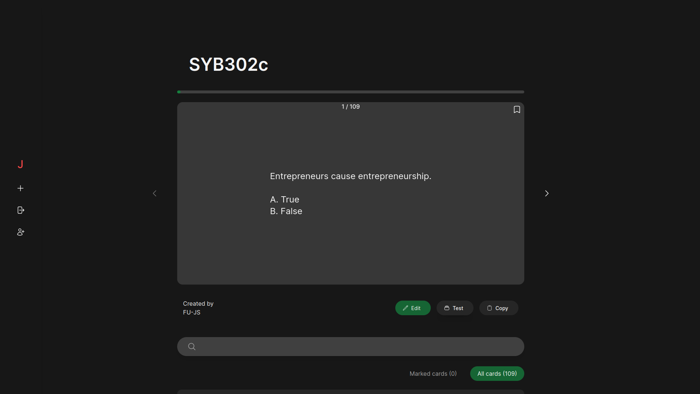

# Jemember

Ứng dụng học flashcard được tạo ra bởi các thành viên JSClub



## Giới thiệu

Đây là repository thuộc về dự án [Jemember](https://jemember.jsclub.tech/), một web app học flashcard lấy cảm hứng từ Quizlet được thiết kế cho các thành viên của câu lạc bộ [JS Club](https://www.facebook.com/fu.jsclub).

## Công nghệ sử dụng

- NodeJS
- NEXT.js 13
- TailwindCSS 3.2.4
- Supabase

## Yêu cầu

- [NodeJS](https://nodejs.org/en/)
- [pnpm](https://pnpm.io/installation)

## Chức năng

- Tạo lesson chứa các thẻ flashcard
- Đánh dấu flashcard
- Kiểm tra flashcard
- Học flashcard
- (Đang phát triển) Import flashcard

## Trạng thái

Hiện tại project đang trong giai đoạn phát triển, hoan nghênh sự đóng góp tới từ mọi người

## Hướng dẫn đóng góp

1. Đọc [hướng dẫn đóng góp](CONTRIBUTING.md)
2. Clone project về local theo câu lệnh

```
git clone https://github.com/fu-js/jemember.git
```

3. Chạy lệnh để cài đặt `node_modules`

```
pnpm i
```

4. Chạy lệnh để chạy web app trên môi trường dev

```
pnpm run dev
```

## Credit

- Founder: Nguyễn Huy Hoàng
- Tài trợ tên miền: Hồ Khánh Vũ
- Hướng dẫn đóng góp: Vũ Hải Lâm
